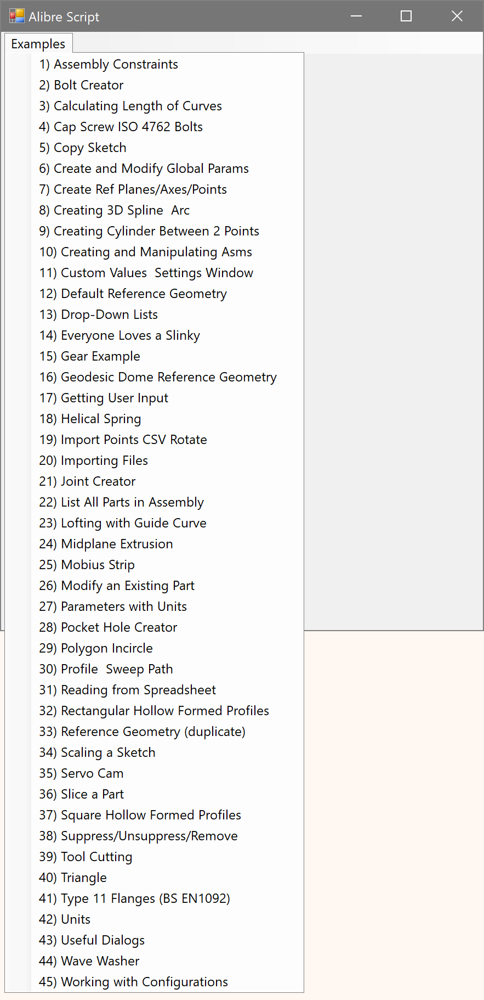
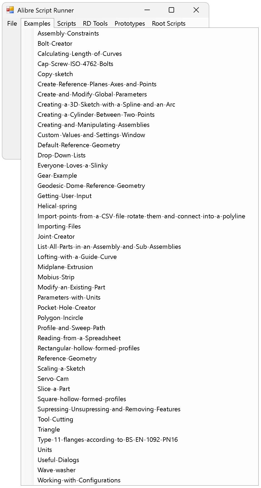

# Alibre Script Runner

A menu-driven launcher that runs IronPython automation scripts against a live Alibre Design session.

The runner connects to an already-open Alibre Design instance through the `AlibreX.AutomationHook` COM object, opens a Windows Forms window, and scans folders under a configurable base path for `.py` files. Each script becomes a menu item; selecting it runs the script in the runner's global scope so the code has direct access to the Alibre Script API (`Part`, `Assembly`, `Windows`, `Units`, and the active `alibre`/`root` objects).

This project targets Alibre Design 29.0.0.29060 and the IronPython engine supplied by the bundled Alibre Script add-on. It ships as IronPython source run through Alibre Script; there is no compiled add-on or installer.

## Table Of Contents

- [What Is Here](#what-is-here)
- [Official Alibre Resources](#official-alibre-resources)
- [Requirements](#requirements)
- [Quick Start](#quick-start)
- [Installation](#installation)
- [Usage](#usage)
- [Key Files](#key-files)
- [Key Folders](#key-folders)
- [Screenshots](#screenshots)
- [Notes](#notes)
- [License](#license)

## What Is Here

- `source/main.py`, the runner that connects to Alibre Design and builds the menu-driven launcher.
- A Windows Forms window with menus generated from the base path's `scripts`, `prototypes`, `randd`, and `examples` subfolders, plus a "Root Scripts" menu for loose `.py` files in the base folder (excluding `main.py`).
- A "File > Set Base Path..." menu item that opens a folder browser and rebuilds the menus against a new base folder at runtime.
- Script errors surfaced in a dialog rather than failing silently.
- Sample scripts under `source/` covering Alibre Script tasks such as assembly constraints, bolts, gears, lofts, sketches, and reference geometry.
- A git submodule reference (`submodules/examples`) pointing at the `alibre-script-examples` repository.

## Official Alibre Resources

Alibre's official resources for API development and AI/LLM/agent workflows: <https://www.alibre.com/api/>

## Requirements

- Alibre Design 29.0.0.29060. The bundled Alibre Script add-on supplies the `AlibreX`, `AlibreScriptAddOn`, and `AlibreScript.API` assemblies. The scripts reference the install path `C:\Program Files\Alibre Design 29.0.0.29060`.
- IronPython, as provided by the Alibre Script add-on (the engine Alibre Script uses to run `.py` files). Scripts should stay Python 2.7 compatible.
- Windows with .NET Windows Forms (`System.Windows.Forms`, `System.Drawing`, `System.Runtime.InteropServices`).
- A running Alibre Design session, since the runner attaches through `Marshal.GetActiveObject("AlibreX.AutomationHook")`.

## Quick Start

1. Start Alibre Design and leave it running.
2. In Alibre Script, open and run `source/main.py`.
3. Set the base path from the "File > Set Base Path..." menu, then pick a script from the generated menus.

## Installation

There is no installer, build step, or add-on manifest. The project is a set of IronPython scripts run through Alibre Script.

1. Clone this repository, including its submodule:

   ```
   git clone --recurse-submodules <repo-url>
   ```

2. Open `source/main.py` and update the Alibre paths if the install differs from `C:\Program Files\Alibre Design 29.0.0.29060`.
3. Set `base_path` in `source/main.py` to the folder that holds the `scripts`, `prototypes`, `randd`, and `examples` subfolders, or change it later from the runner's "Set Base Path..." menu. The default in the file is `T:\a\alibre-script-runner` and will need changing on most machines.

## Usage

1. Start Alibre Design and leave it running.
2. In Alibre Script, open and run `source/main.py`. If Alibre Design is not running, the runner reports a connection error and exits.
3. The "Alibre Script Runner" window opens. Menu titles map to base-path folders: Scripts (`scripts`), Prototypes (`prototypes`), R&D Tools (`randd`), Examples (`examples`), and Root Scripts (loose `.py` files in the base folder). A menu appears only when its folder contains `.py` files.
4. Select a script to run it against the live Alibre session. Any error is shown in a dialog.

## Key Files

| File | Purpose |
| --- | --- |
| `source/main.py` | The runner: connects to Alibre Design, scans folders, builds the Windows Forms menus, and executes the selected script in global scope. |
| `source/main_ex1.py`, `source/main_ex2.py`, `source/main_ex3.py` | Standalone example scripts in the base folder (listed under Root Scripts). |
| `source/scripts/ex_as_fun_1.py` | Example Alibre Script code (assembly constraints). |
| `source/scripts/ex_as_fun_2.py` | Example code wrapping Alibre Script tasks inside callable functions. |
| `source/prototypes/Equation-Editor-Function-Calling.py` | Prototype Windows Forms equation editor for function-driven part edits. |
| `source/randd/spline-tools.py` | R&D spline script. |
| `source/alibre.disclaimer.txt` | Licensing and branding disclaimer. |
| `.gitmodules` | Declares the `submodules/examples` submodule (`alibre-script-examples`). |
| `reviews/2026-06-20-code-review.md` | Code review notes. |
| `LICENSE` | MIT license. |

## Key Folders

| Folder | Purpose |
| --- | --- |
| `source/` | The runner and sample scripts. |
| `source/scripts/` | Scripts listed under the Scripts menu. |
| `source/prototypes/` | Scripts listed under the Prototypes menu. |
| `source/randd/` | Scripts listed under the R&D Tools menu. |
| `submodules/examples/` | Submodule pointing at `alibre-script-examples` (populated after `--recurse-submodules`). |
| `documentation/` | Documentation placeholder (currently empty). |
| `reviews/` | Code review notes. |
| `.github/` | This README and repository templates. |

## Screenshots

The "Alibre Script Runner" window with the Examples menu expanded:



An earlier build of the launcher window:



## Notes

- Alibre Script runs on IronPython, so keep scripts Python 2.7 compatible.
- The runner attaches to a running Alibre session over COM; it cannot start Alibre Design for you.
- `base_path` defaults to `T:\a\alibre-script-runner`, and the Alibre install paths are hard-coded to version 29.0.0.29060. Both usually need adjusting.
- Selected scripts run in the runner's global scope, so they share its imported modules and Alibre objects.
- The `examples` menu draws from the base path's `examples` folder; the repository ships that content through the `submodules/examples` submodule.

## License

See [LICENSE](../LICENSE).

Alibre, Alibre Design, and Alibre Script names and related materials belong to their respective owners.
